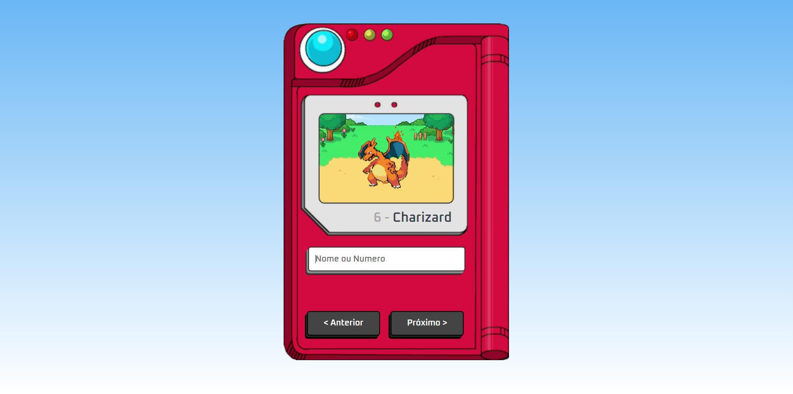

# Pokedéx !

***
### Sobre o projeto.
Projeto simples em que o usuário pode pesquisar pokemons inserindo o número,nome ou clicando nos botões *anterior/próximo*.
Obs: Devido ao pequeno problema na pokeApi,os pokemons com id(número) 650 pra cima não são animados.
#
### Habilidades.
* *HTML*
* *CSS* 
* *JavaScript* 

